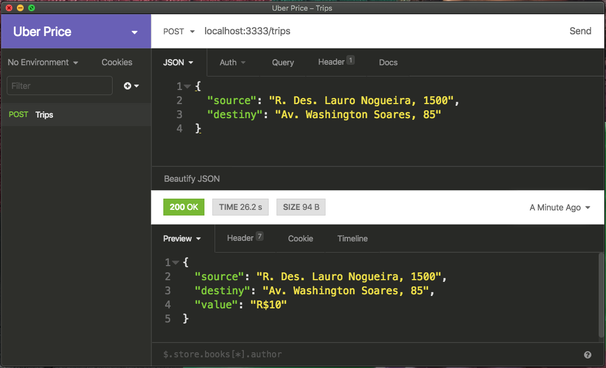

## Calculadora de preço da Uber

Api para buscar informações via Web Crawler no site do Uber.




### Bibliotecas

* puppeteer
* cheerio
* express
* yup
* cors
* eslint
* nodemon
* prettier
* sucrase

### Instalação/Execução

```
git clone https://github.com/DanAraujjo/uber-price
cd uber-price
yarn
yarn dev
```

> Exemplo de requisição
```
curl --request POST \
  --url http://localhost:3333/trips \
  --header 'content-type: application/json' \
  --data '{
	"source": "R. Des. Lauro Nogueira, 1500",
	"destiny": "Av. Washington Soares, 85"
}'
```
